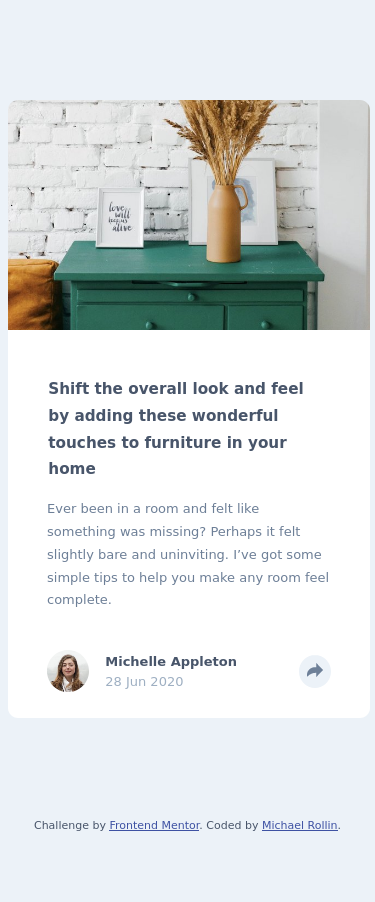
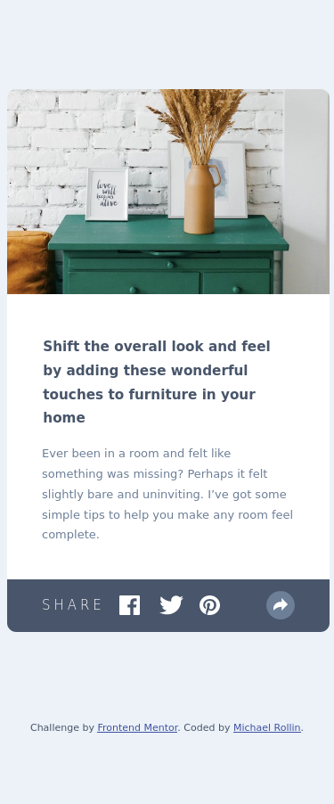
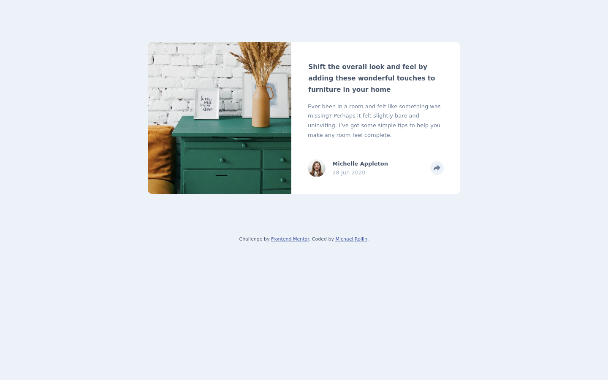
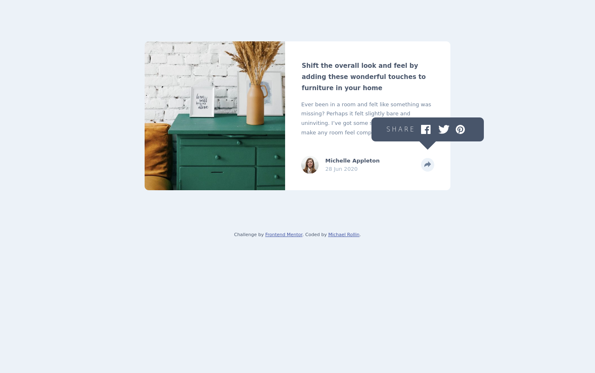

# Frontend Mentor - Article preview component solution

This is a solution to the [Article preview component challenge on Frontend Mentor](https://www.frontendmentor.io/challenges/article-preview-component-dYBN_pYFT). Frontend Mentor challenges help you improve your coding skills by building realistic projects. 

## Table of contents

- [Overview](#overview)
  - [The challenge](#the-challenge)
  - [Screenshots](#screenshot)
  - [Links](#links)
  - [Built with](#built-with)
  - [What I learned](#what-i-learned)
  - [Continued development](#continued-development)
  - [Useful resources](#useful-resources)
- [Author](#author)

### The challenge

Users should be able to:

- View the optimal layout for the component depending on their device's screen size
- See the social media share links when they click the share icon

### Screenshots






### Links

- Solution URL: [Github](https://github.com/Michael080/front-end-mentor/tree/main/newbie/7_article-preview-component)
- Live Site URL: [Github Pages](https://michael080.github.io/Article-Preview-Component-frontendmentor.io-/)

### Built with

- Semantic HTML5 markup
- CSS custom properties
- Flexbox
- CSS Grid
- Mobile-first workflow
- Javascript

### What I learned

I learned how to use the 'resize' event in JavaScript to check the screen-size when users adjust their browsers.

I learned about the background-bleed problem that occurs when using border-radius on background-images and how to fix it by nesting the image in a div w/ the correct background-color.

I learned how to create triangles using CSS border properties.

CSS Triangle:
```html
<div class="arrow-container">
  <div class="arrow-down"></div>
</div>
```
```css
.arrow-down {
  margin: 0 auto;
  width: 0;
  height: 0;
  border-left: 20px solid transparent;
  border-right: 20px solid transparent;
  border-top: 20px solid var(--dark-grayish-blue);
}
```

### Continued development

Towards the end of this project I was dealing with a bug that I think was created by the tooltip share buttons. When the user clicks the share button a tooltip appears just above the button in the foreground of the description text via position: relative. When clicked the footer either goes down or up a bit which was unexpected as I thought position relative removed the elem from the layout-flow. I still am unsure what exactly created this bug which I fixed by adjusting margin-properties w/ JavaScript but intend on finding out how to avoid this in the future.

### Useful resources

- [W3 Schools - onresize article](https://www.w3schools.com/jsref/event_onresize.asp) - This is a good resource for learning about the onresize event. It includes another method which I didn't use on this project for 'assigning' a function to an onresize method which looks interesting.
- [CSS Tricks - CSS Triangle](https://css-tricks.com/snippets/css/css-triangle/) - This article breaks down drawing triangles w/ CSS.

## Author

- Github - [Michael Rollin](https://github.com/Michael080)
- Frontend Mentor - [@Michael080](https://www.frontendmentor.io/profile/Michael080)
- Twitter - [@MichaelRollin5](https://www.twitter.com/ichaelRollin5)